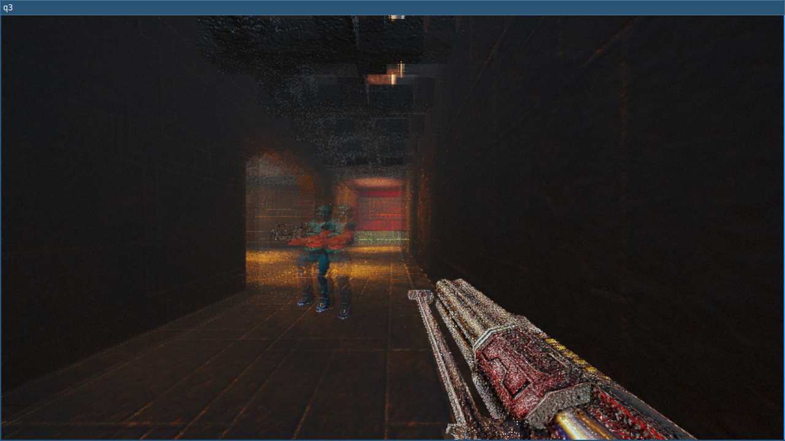

# Q3 — Vulkan Raytracing Engine

A from-scratch Vulkan ray tracing engine inspired by Quake 3 / Id Tech 3, written as a single C file with inline GLSL shaders.



## Quick Start

```sh
# Install dependencies (Debian/Ubuntu)
sudo apt-get install -y libsdl2-dev libvulkan-dev libopenal-dev \
                        glslang-tools mesa-vulkan-drivers

# Bootstrap the build tool (once)
cc -o sdk sdk.c

# Build
./sdk

# Run
./build/q3
```

`sdk` auto-rebuilds itself when `sdk.c` changes.

## How It Works

The engine lives in a single file (`q3.c`) with GLSL shaders embedded inline:

```c
glsl rgen Ray_Generation {
  #version 460
  #extension GL_EXT_ray_tracing : require
  // ... ray generation shader code ...
}
```

The build tool (`sdk.c`) extracts these `glsl <stage> <Name> { ... }` blocks, compiles them to SPIR-V via `glslangValidator`, then compiles the remaining C code with the shaders excised and a `Shader_Path(Name)` macro injected to reference the `.spv` files.

Forward declarations (`glsl <stage> <Name>;`) serve as documentation in the specification section and are stripped from the compiled output.

## Architecture

| File | Purpose |
|------|---------|
| `q3.c` | Monolithic engine — Vulkan setup, BSP loading, ray tracing pipeline, physics, audio, game loop |
| `sdk.c` | Build script — shader extraction, SPIR-V compilation, C compilation |
| `nobuild.h` | [nob.h](https://github.com/tsoding/nob.h) v3.2.2 — vendored single-header build library |
| `assets/` | Game assets (textures, models, maps, sounds) |

## Shaders

| Shader | Stage | Description |
|--------|-------|-------------|
| `Ray_Generation` | `rgen` | Primary ray casting from camera |
| `Closest_Hit` | `rchit` | Surface shading, shadows, reflections |
| `Ray_Miss` | `rmiss` | Sky/environment for missed rays |
| `Shadow_Miss` | `rmiss` | Shadow ray miss (fully lit) |
| `Physics` | `comp` | GPU-driven player physics (Quake 3 movement) |
| `Denoise` | `comp` | A-trous wavelet spatial denoiser |
| `Post_Process` | `comp` | Tonemapping, TAA, bloom, vignette |

## Dependencies

- **SDL2** — windowing and input
- **Vulkan 1.3** — graphics (with `VK_KHR_ray_tracing_pipeline`)
- **OpenAL** — positional audio
- **glslangValidator** — GLSL to SPIR-V compilation (build-time only)
- **Mesa lavapipe** — software Vulkan with ray tracing (for headless/CI testing)

## Headless Testing

For software-rendered testing without a GPU (e.g. CI):

```sh
# Install headless compositor and software Vulkan
sudo apt-get install -y sway mesa-vulkan-drivers grim

# Start headless sway
export WLR_BACKENDS=headless WLR_RENDERER=pixman WLR_LIBINPUT_NO_DEVICES=1
sway --unsupported-gpu -c /dev/null &

# Run with lavapipe
VK_ICD_FILENAMES=/usr/share/vulkan/icd.d/lvp_icd.json ./build/q3

# Capture screenshot
grim /tmp/screenshot.png
```

## Cross-Compilation

```sh
./sdk --windows    # Windows (mingw)
./sdk --macos      # macOS (MoltenVK)
./sdk --debian     # Debian/Ubuntu release
./sdk --all        # All platforms
./sdk --prod       # Production (strips validation layers)
```
